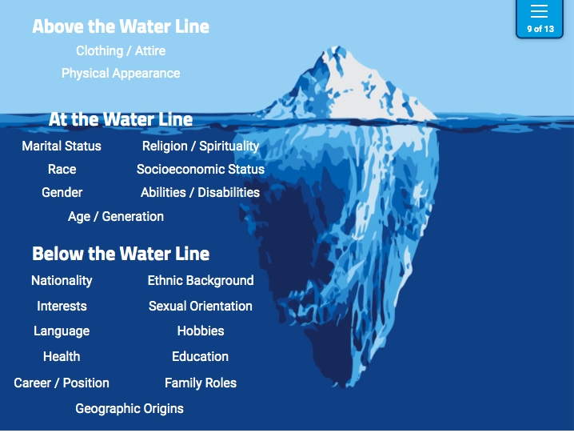

# Identity & Intersectionality Session

[Workshop Presentation Link](https://www.canva.com/design/DAE6b8Xqyuo/oMWbd1na4HWxx484XyYvtA/view?utm_content=DAE6b8Xqyuo&utm_campaign=designshare&utm_medium=link&utm_source=shareyourdesignpanel#12)

## Social Justice Overview

- **What is Social Justice?** Social justice is justice in terms of the distribution of wealth, opportunities, and privileges within a society
- **Five Principles of Social Justice**
    - Access to resources
    - Equity: How people are given resources specific to their needs to work towards similar outcomes for all?
    - Participation: How folks are given a voice to issues?
    - Diversity
    - Human Rights

## Identity Concepts
- **Identity Overview**
    - Nuanced & complex
    - Physical, social, and mental characteristics and beliefs of individuals that are both internally constructed and externally applied
    - Visible and invisible
        - Identity is like an iceberg: understanding someone's identity is sometimes limited by what we see on the surface

    

      - Above the Water: Things that are visible and we can make limited judgments about a person
      - Right at the Water: Might see something that indicates characteristics, but we lack certainty and should caution ourselves on judgments
      - Below the Water: Things unseen and can’t know without establishing a relationship with the person

### Reflect on the following questions:
  - How does it make you feel when folks make an assumption about your identity based on their biases? 
  - What words or labels do you use to describe yourself? Why?
  - What words might others use to describe you?
  - What words might others use to describe you that you would not choose for yourself?

**Reflect on your Bio-Poem:** If you are more comfortable acknowledging your identity you can better support others and their identities 

**How can I get to know others better?**
 - Pause & think
 - Don't guess or make assumptions, get to know a person by asking questions that allow them to tell you who they are
 - Practice the following:
    - Focus on seeing people as individuals
    - Work on consciously changing your stereotypes
    - Take time to pause and reflect
    - Adjust your perspective
    - Increase your exposure
    - Practice mindfulness (do not be overly reactive, live in the moment)

## Intersectionality
  - Overview
    - [Intersectionality 101](https://www.youtube.com/watch?v=O1islM0ytkE&t=1s) (2:49 mins) 
      - All aspects of our identities – whether those aspects are oppressed or privileged by society – interact with one another
    - The purpose of naming and reflecting on identity is not to seperate them out from each other so much as to consider the ways in which our identities impact each other
    - “So long as we are divided because of our particular identities we cannot join together in effective political action.” -Audre Lorde
      - It’s important that we see our shared humanity through our many identities. Question: Why do you think Audre Lorde felt this important to establishing effective change?
    - “Why does it have to be you as a woman? Why not you as a human being?’ This type of question is a way of silencing a person's specific experiences. Of course, I am a human being, but there are particular things that happen to me in the world because I am a woman.” - Chimamanda Ngozi Adichie
    - Each of us should look at our own privileges and power as it relates to our identity
      - Privilege and oppression intersect — but they don’t negate one another
      - We need to acknowledge certain privileges are granted to some folks more than others; oppression olympics should not be portrayed in social justice work

### Resources/Articles
  - [Reflecting on Social Justice Foundational Concepts](https://lo.library.wisc.edu/DEI_foundations/lesson_1.html) by the University of Wisconsin-Madison
  - [Bio-poem: Connecting Identity and Poetry from Facing History & Ourselves](https://www.facinghistory.org/resource-library/teaching-strategies/biopoem-identity-poetry)
  - [Social Identities and Systems of Oppression](https://nmaahc.si.edu/learn/talking-about-race/topics/social-identities-and-systems-oppression) from The National Museum of African American History and Culture
  - [Social Identity Worksheet](https://timeandplace.ubc.ca/files/2014/06/Appendix-2.pdf) from Time and Place at UBC: Our Histories and Relations and adopted from Diane J. Goodman
